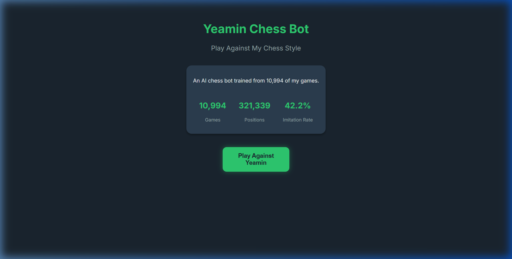
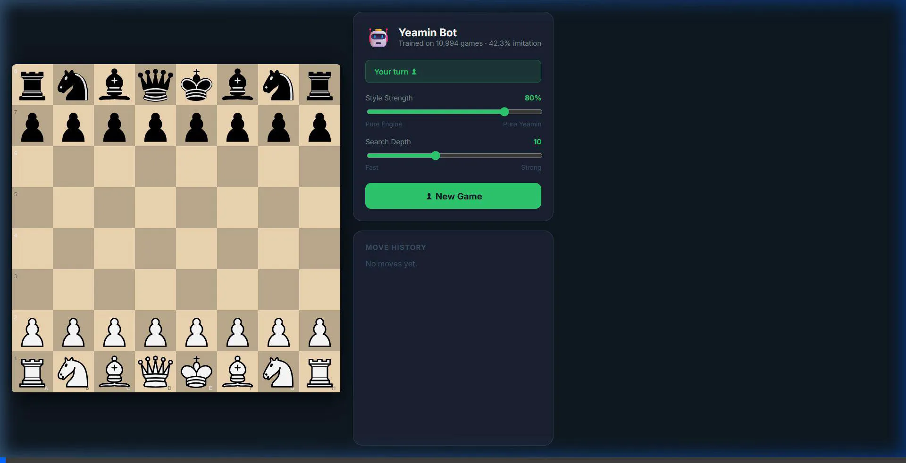

<div align="center">
  
  <h1>Yeamin Chess Bot</h1>
  <p><strong>A personal, machine-learning powered chess engine that plays exactly like you.</strong></p>
</div>



## Overview

Most chess bots are designed to play perfect, unhuman chess. **Yeamin Chess Bot** is different. It is an AI trained exclusively on **10,994 of my personal Chess.com games**. 

Instead of asking *"What is the objectively best move here?"*, the engine asks *"What move is Yeamin most likely to play?"* It captures my actual playing style, including my opening preferences, attacking tendencies, and even typical tactical patterns.

<div align="center">
  
  <p><em>Sleek, dark-mode immersive web interface built with React and Chessground.</em></p>
</div>

## 🧠 How it Works (The Math)

The bot uses a hybrid engine combining traditional chess computation with modern machine learning:

1. **Stockfish MultiPV Search:** When it's the bot's turn, a WebAssembly build of Stockfish 16 looks at the board and generates the top 15 legal candidate moves.
2. **Feature Extraction:** The board state is mathematically broken down into features (material balance, king safety, center control, etc.).
3. **Machine Learning Evaluation:** A `HistGradientBoostingClassifier` (trained in Python and exported to JSON for the web) evaluates the candidate moves. It assigns a **probability score (0% to 100%)** representing how likely I am to play that move.
4. **Style Blending:** Based on your chosen "Bot Personality" setting, the bot blends Stockfish's objective evaluation with the ML model's style probability to pick the final move. 

## 📊 Dataset & Model Statistics

- **Dataset Size:** 10,994 real games
- **Positions Analyzed:** 321,339 unique board states
- **Top-1 Imitation Rate:** `42.4%` (The bot predicts my exact real-life move as its #1 choice 42.4% of the time. Pure Stockfish only matches human moves ~36% of the time).
- **Top-5 Coverage:** `74.4%` (My real-life move is within the model's top 5 predictions 75% of the time).
- **Time-Decay Weighting:** The ML pipeline uses exponential time-decay weighting (halving every year). Games I played recently have a massive influence on the model, while games from years ago when I was a beginner have very little weight.

## ⚔️ Hardcoded Repertoire

The bot forces my preferred aggressive openings during the first 5 moves of the game via a high-priority injection script:
- **As White:** Plays 1. e4, and actively seeks King's Gambit setups (2. f4, 3. Nf3).
- **As Black:** Plays Modern/Pirc setups (g6, d6, Nf6).

## 🛠️ Technology Stack

**Machine Learning (Backend / Data Prep):**
- Python, Pandas, Parquet
- `scikit-learn` (HistGradientBoostingClassifier)
- Joblib, python-chess

**Web Interface (Frontend):**
- React 18, TypeScript, Vite
- Lichess `chessground` (for the premium board UI)
- `chess.js` (for move validation and FEN tracking)
- Vanilla CSS (Custom dark-mode glassmorphism design)

## 🚀 How to Run Locally

### 1. The Web App
```bash
cd yeamin-bot-web
npm install
npm run dev
```
Open `http://localhost:5173` in your browser. The web app is completely standalone — the machine learning model (`yeamin_style_model.json`) and Stockfish are both loaded directly in the browser!

### 2. Retraining the ML Model (Optional)
If you play more games and want to update the bot:
```bash
cd chess-data
python run_phase4.py    # Retrains the HistGBM with time-decay weighting
python export_json.py   # Exports the trained model to the web directory
```
